<!-- ============================ HEADER ============================ -->
<div align="center">


<a href="https://github.com/Rusith1204">
  
</a>

<br/>


-00ff9c?style=for-the-badge&labelColor=0d1117)

</div>


## 🖥️ `whoami`

<div align="center">
  
</div>

<br/>

```python
class Rusith:
    alias       = "Rusiya 😄"
    location    = "Sri Lanka 🇱🇰"
    pronouns    = "he/him"
    role        = ["Aspiring Ethical Hacker", "Security Engineer (in progress)", "Full Stack Developer"]
    focus       = "Cybersecurity + building scalable & secure web applications"
    learning    = ["Python", "Java", "React Native", "Penetration Testing", "Network Security"]
    hobbies     = ["Coding", "Gaming", "Music", "CTFs"]
    motto       = "Think like an attacker. Build like a defender."
    contact     = "rusithbandara20021204@gmail.com"
```


## 🕶️ Hacker Mode

<div align="center">
  
</div>


## 💻 `./hack.py`

<div align="center">
  
</div>


## 🛡️ Cybersecurity Focus

<table align="center">
<tr>
<td valign="middle">

| 🎯 Focus Area | 🔧 What I'm Exploring |
|---|---|
| **Offensive Security** | Recon, enumeration, web app pentesting, OWASP Top 10 |
| **Defensive Security** | Hardening, secure coding, log analysis, threat detection |
| **Networking** | TCP/IP, packet analysis, firewalls, network scanning |
| **Practice Labs** | CTFs, TryHackMe, Hack The Box, home lab |

</td>
<td align="center" valign="middle">
  
</td>
</tr>
</table>

<div align="center">
<i>⚠️ All security testing is performed only in authorized, legal lab environments.</i>
</div>


## 🛠️ Tech Stack & Tools

<div align="center">

<h3>💻 Languages</h3>


<h3>⚙️ Frameworks & Platforms</h3>


<h3>🔧 Tools & Editors</h3>


<h3>🛡️ Cybersecurity Tools</h3>

<br/><br/>

</div>


## 🐍 Contribution Snake

<div align="center">

<picture>
  <source media="(prefers-color-scheme: dark)" srcset="https://raw.githubusercontent.com/Rusith1204/Rusith1204/output/github-snake-dark.svg" />
  <source media="(prefers-color-scheme: light)" srcset="https://raw.githubusercontent.com/Rusith1204/Rusith1204/output/github-snake.svg" />
  
</picture>

</div>


## 📊 GitHub Analytics

<div align="center">


<br/>


</div>


## 🎯 Featured Projects

<div align="center">

<a href="https://github.com/Rusith1204/lecture_dash_board"></a>
<a href="https://github.com/Rusith1204/GYM-website"></a>

</div>


## 💡 Coding Activity

<div align="center">


</div>


## 🔐 Currently Running

```bash
$ while true; do
>   learn --topic security
>   practice --lab ctf
>   build --secure
>   if [ "$vulnerability" == "found" ]; then report && patch; fi
> done
```


## 📫 Connect With Me

<div align="center">

[](https://www.linkedin.com/in/rusith-bandara-3807a0338/)
[](mailto:rusithbandara20021204@gmail.com)
[](https://rusith1204.github.io/My_portfolio/)

</div>

<div align="center">

### ⚡ *"First, solve the problem. Then, write the code."* — John Johnson

⭐ **Thanks for visiting my profile!**


</div>
